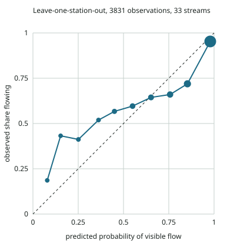

# fountains

> **A score is never a reason to leave with less water.** Carry what you need for the whole ride as if every fountain were dry. This tool says nothing about whether the water is safe to drink.

Will the fountains along your ride be running on the day you ride?

You export your route as a GPX file and drop it on a local page. It lists every fountain that OpenStreetMap or IGN (the French national mapping agency) knows within a short detour of the route, adds the places where clues in open data suggest a fountain no map has, and shows each one on street photos so you can say which are real. The fountains you keep get a band (**likely**, **uncertain** or **unlikely** to be running) for the day you ride, with the reason and the date anyone last checked them. On long stretches without a likely fountain, it also lists the cafés, bakeries, small shops and fuel stations, and whether they are open when you should pass. Everything goes onto your bike computer as one GPX. The screen part takes a few minutes; the rest happens outside.

It works in Corsica only, because that is where the model learned.

**Built with PriorLabs-TabPFN.**

## Install

Python 3.10 or newer. Everything runs on a CPU; no GPU, no account, no API key.

```bash
git clone https://github.com/dsiacci/fountains && cd fountains
python3 -m venv .venv && . .venv/bin/activate
pip install torch --index-url https://download.pytorch.org/whl/cpu   # the CPU build, much smaller
pip install -e ".[photos]"   # editable: the tool reads its data from the data/ folder of this checkout
```

`[photos]` adds the vision model that ranks the street photos (`transformers`, `pillow`); without it, the photos are shown unranked. The first run downloads the TabPFN v2 classifier weights (29 MB, from Hugging Face, `Prior-Labs/TabPFN-v2-clf`), the OWLv2 detector (0.6 GB, `google/owlv2-base-patch16-ensemble`) and the Météo-France daily file of the current year (about 1 MB, refreshed every 6 hours).

Or with Docker (macOS, Windows, Linux), nothing else to install:

```bash
docker build -t fountains .
docker run --rm -p 127.0.0.1:8765:8765 -v fountains-cache:/cache fountains
```

The `fountains-cache` volume keeps the models, the data, your rides and your decisions between runs.

## Use

### The page: check every point on photos, then score the ones you keep

```bash
fountains serve
```

Open http://localhost:8765 (with Docker, it is already running) and drop a GPX file on it.

1. **The water points the maps know** within 250 m of the track appear at once, in riding order, counted as fountains until you say otherwise. A minute later come the **places found from clues** (see *Fountains no map has*); they stay out of your GPX unless you mark them.
2. **Every point gets the street photos around it**: the Panoramax 360° pictures within 100 m, cropped toward both roadsides and toward the mapped position. An open vision model (OWLv2) puts first the views where it sees something like a fountain, and draws a box on it. Next to them, Plan IGN and the aerial view of the spot.
3. **You decide**, point by point: *Fountain*, *Not a fountain* or *Not sure*. A point with no photo can be decided too, from the plan, the aerial view or what you know, and a fountain you know can be added by clicking the map.
4. **Score**: the day, your start time and pace. Each fountain you kept gets its band, and on long stretches without a likely fountain a few cafés, shops or fuel stations are suggested (the same rules as the command line below).
5. **Download the GPX**: your track with a waypoint for each fountain kept (`likely: Funtana di Leccia`), each point you were not sure about (`check: ...`), and each café or shop suggested on the long stretches. Names start with the band, so a bike computer that shortens names still shows it.

Your decisions are saved: drop the same file again and they are still there. The page listens on this computer only (`127.0.0.1`).

### The command line

```bash
fountains score my-ride.gpx --date 2026-10-11 --html
```

It scores every point the maps know, without the photo check.

- `--date`: the day you ride (default: today). Rain measured up to the last Météo-France report is used, then the Météo-France forecast for the days in between. Forecast days that are not available yet count as dry, so a missing forecast never makes a fountain look wetter.
- `--max-detour 250`: how far off the route you are willing to go, one way, along roads and paths, in metres.
- `--start 08:30`: when you leave. The tool then gives a passing time for every point and checks the opening hours of cafés and shops at that time. Passing times come from a plain pace model, `--flat-kmh 20` on the flat plus `--climb-mh 500` metres climbed per hour, using the elevation in the GPX file when it has some. Set them to your own pace.
- `--gap-km 10`: stretches at least this long without a likely fountain get their list of cafés, shops and fuel stations, and about one suggestion per 10 km.
- `--out out/`: where the files go.

It prints the table and writes four files:

| File | For |
|---|---|
| `<track>-<date>.txt` | the table above, to read before leaving |
| `<track>-<date>-waypoints.gpx` | waypoints for a bike computer, named like `likely: Funtana Vechja`, with the reason in the description |
| `<track>-<date>.geojson` | everything, for a map or another tool |
| `<track>-<date>.html` | a map (with `--html`): OpenStreetMap, Plan IGN or IGN aerial photos as background; click a point to see it from the street, turned toward it, and on the plan |

Every point within the detour limit is listed, in riding order. None is hidden, none is ranked. Points that are close as the crow flies but further than the limit by road or path are listed in a second section with their real detour. Points tagged `access=private` or `access=no` are left out and counted; `access=customers` is shown with a note.

Other commands:

- `fountains discover --around 41.76,8.77` looks for fountains no map has around a place, and writes a page of street photos to look at.
- `fountains trim ride.gpx shared.gpx --start 1500 --end 1500` cuts the first and last 1.5 km of a track and drops every timestamp and author field, before you share a track.
- `fountains check-memories memories.csv` compares the bands with what someone remembers seeing (see below).
- `fountains calibrate` and `fountains build-data --all` rebuild the model's measurements and the files in `data/` from the open sources.

## How it works

### 1. The fountains

Two open sources, merged:

- **OpenStreetMap**, through the Overpass API: every `amenity=drinking_water` and `amenity=water_point`, plus springs, taps, wells and decorative fountains tagged `drinking_water=yes` or `conditional`, minus anything tagged `drinking_water=no`. On 6 October 2026 that is 608 points in Corsica. Only 2 of them say whether they are seasonal (`seasonal=*`).
- **IGN BD TOPO®**, the national topographic database, open since 1 January 2021: its « détail hydrographique » features of nature « Fontaine », 1,493 in Corsica, 414 of them named. Only 250 have an OpenStreetMap drinking-water point within 30 m. BD TOPO says nothing about drinking water, so an IGN-only fountain carries a note saying so.

A pair from both sources within 30 m is shown once, as the OpenStreetMap point with the IGN name when OSM has none. Natural springs, captured springs, cisterns and wash houses (also in BD TOPO) are not listed as fountains, since most are not places to fill a bottle; the page uses them as clues instead (see *Fountains no map has*). Nobody records whether a fountain runs, which is the gap this tool tries to fill.

Each point is attached to the nearest road or path, and the detour is measured along the network from the route. A fountain 40 m from the road as the crow flies can be 400 m away if the only access is a loop through the village.

### Seeing the place before going

For each point, the tool looks on [Panoramax](https://panoramax.fr), the open street-imagery commons, for a picture that looks at it. Around Corsican roads most are IGN's 360° captures of spring 2025, so the map shows the panorama already turned toward the point (drag to look around) and links to the Panoramax viewer at the same heading. Each picture keeps its date, distance and licence. Without a picture within 60 m, an IGN aerial view takes its place. A Plan IGN extract, centred on the point, is always there. `--no-photos` skips the Panoramax lookup.

### Fountains no map has

Many roadside fountains are on no map, or mapped in the wrong place. The page looks for clues along the track, in open data only:

- IGN BD TOPO fountains, wash houses, water points, springs and captured springs close to a paved road;
- the places where a stream crosses a paved road, because a spout is often built where the slope brings water down to the road.

Only the paved roads and streams within 400 m of the track are kept, and a clue counts if its road passes within 100 m of the track. Each one becomes a place to check, with the street photos around it: four 100° views per picture, set diagonally to the road, so a fountain a few metres off the road is in frame whatever the spacing of the pictures, plus one toward the clue when it lies away from the road. OWLv2, an open-vocabulary object detector (Apache 2.0), looks in every view for "a water fountain", "a water spout", "a stone water trough" or "a water tap"; boxes that touch the bottom tenth of a view are ignored, because that is where the camera car's roof and bonnet show.

The model only orders the photos. You decide, and nothing is ever added to a map by the tool; if a place turns out to be a fountain, you can map it yourself on OpenStreetMap.

### Where else to fill a bottle

No model here. Cafés, bars, restaurants, bakeries, small shops, supermarkets and fuel stations come from OpenStreetMap (a snapshot of Corsica in `data/`). On every stretch of `--gap-km` or more between likely fountains (counting the start and the end), the ones within the detour limit are listed with the time you should pass them and their state at that time: open, closed, or hours unknown. A few of them are suggested, about one per `--gap-km`: open when you pass first, then hours unknown, cafés, bakeries, shops and fuel stations before restaurants, then the shortest detour; never one whose hours say it is closed, and none in the first 3 km of a stretch, where bottles are still full. Only the suggested ones go into the GPX (on a wet October day, the first 45 km of the author's loop have 56 places within 250 m of the road). The opening hours are read from OpenStreetMap's `opening_hours` tag with a deliberately small parser: anything it does not understand (comments, sunrise, week numbers) is reported as unknown rather than guessed, and public holidays are not modelled.

### 2. The rain

- **Measured**: Météo-France daily rain gauges in Corsica (103 gauges reported since 2010, 52 of them still active). The rain at a fountain is interpolated from the three nearest gauges that reported that day, weighted by the inverse square of the distance.
- **Normal**: for each gauge, the mean rain of the 30, 90 and 180 days before each day of the year over 1991-2020. That turns "45 mm in 90 days" into "38 % of normal".
- **Forecast**: the Météo-France models (AROME, ARPEGE), at the fountain, through Open-Meteo, for the days between the last gauge report and the ride.

Altitude is not used to correct the interpolation; it is given to the model as its own input (IGN altitude of the point).

### 3. The model: TabPFN, given 3,831 stream observations

Nobody publishes whether fountains run. What France does publish is whether small streams run: every summer since 2012, agents of the Office français de la biodiversité walk to the same points on small streams and record what they see (the ONDE network). In Corsica that is 33 streams and 3,831 usable observations from 2012 to 2026.

The model answers one question: *is flowing water visible?* ONDE records four states; "flowing, normal" and "flowing, weak" count as yes, "water but no visible flow" and "dry" count as no. A fountain fills a bottle only if water flows, and this is also the only split that means the same thing in every year: from 2016 to 2019 and in 2022, Corsican observers recorded only "flowing", without the normal/weak distinction.

Inputs: the day of the year, the altitude, the rain of the last 30, 90 and 180 days, and how the last 90 and 180 days compare with the 1991-2020 normal there. The two ratios to normal were kept by the validation below: they lowered the Brier score from 0.118 to 0.114.

[TabPFN](https://github.com/PriorLabs/TabPFN) (Prior Labs) is a tabular foundation model: a transformer pre-trained on millions of synthetic tables, which takes the training rows as context and predicts new rows in one forward pass. There is no training loop and no hyperparameter search. It runs here on a CPU with the open v2 weights.

### 4. How far to trust it

*Leave-one-station-out*: each of the 33 streams is hidden in turn, the model gets the other 32 as context, and predicts the hidden one, which it has never seen. Pooled, these predictions give the Brier score, a comparison with simpler baselines (the rate for the month, a logistic regression on the same inputs) and the reliability curve: among the cases the model scored around *p*, how many were flowing.

The bands come from that curve and from targets fixed before the first run: **likely** where at least 90 % of the hidden cases were flowing, **unlikely** where at most 50 % were, **uncertain** in between. The tool shows bands, not percentages, because a percentage measured on streams would claim more than we know about fountains.

Results, pooled over the 3,831 hidden observations (`data/calibration.json`; the run without the ratios is in `data/calibration-base.json`):

| | Brier score (lower is better) |
|---|---|
| TabPFN v2, 7 inputs (kept) | 0.114 |
| Logistic regression, same 7 inputs | 0.115 |
| TabPFN v2, without the ratios to normal | 0.118 |
| Logistic regression, without the ratios | 0.116 |
| The rate for the month | 0.127 |
| Always the overall rate (83 % flowing) | 0.141 |

TabPFN is a little better than a logistic regression on the same inputs, by a margin too small to matter, and both beat the calendar by about 10 %. The model knows something, not much; the bands say how much.



On streams it has never seen, TabPFN's probabilities are too extreme: cases scored around 0.85 were flowing 72 % of the time, cases scored around 0.15 were flowing 43 % of the time. The bands absorb that:

| Band | Model probability | Hidden cases | Flowing (95 % interval) |
|---|---|---|---|
| likely | 0.956 and above | 1,965 | 97.6 % (96.8 to 98.2) |
| uncertain | in between | 1,734 | 71.0 % (68.9 to 73.1) |
| unlikely | 0.288 and below | 132 | 32.6 % (25.2 to 41.0) |

Both targets are met: at least 90 % of the "likely" cases were flowing, at most 50 % of the "unlikely" ones. "Unlikely" is rare, 3 % of the cases: even at the end of summer, most of the streams the observers visit keep some visible flow.

### 5. The weak link: a fountain is not a stream

The model assumes that a fountain fed by a spring dries up like a small headwater stream after the same weather. That is plausible for a village fountain on a shallow spring, wrong for a fountain on the town mains (which runs whatever the rain), and unknown for a deep spring that reacts months later. OpenStreetMap almost never says which is which.

This assumption is tested on real fountains in two ways, both small:

- **Memories**: what the author remembers seeing at the fountains of his usual routes in September 2026 (`fountains check-memories`). Memories are not measurements, and the sample is small. The model is never adjusted to agree with them.
- **A ride**: the bands computed before a ride, and what the fountains actually did.

*Results: filled in after the checks.*

## Limits

- **Streams are not fountains** (above). This is the main one.
- **Only what the maps and the clues reveal.** A fountain that is on no map, near no clue, or out of sight of the street photos does not exist for this tool. Map positions can be off by tens of metres.
- **Street photos** cover the main roads (IGN's 2025 captures); many small roads have none. The vision model misses fountains hidden in shade or behind a car, and sees fountains in ornamental urns and road furniture: it orders photos, it decides nothing.
- **Rain is interpolated** between gauges that can be 10 to 20 km away and hundreds of metres lower; mountain rain is underestimated.
- **The forecast** reaches 2 to 4 days ahead; beyond that, the days count as dry.
- **Potability**: never assessed. `drinking_water=yes` in OpenStreetMap is what a mapper wrote, not a water test.
- **Corsica only**: the stream observations and the rain gauges are Corsican; the tool refuses tracks elsewhere.
- **Opening hours** are often missing from OpenStreetMap, and passing times come from a pace you set, not from your past rides.
- **CPU time**: TabPFN reads its 3,831 rows of context at each run; on a small 2-core machine a score takes one to two minutes. Ranking the street photos is longer: a few seconds per view on such a machine, and a 70 km ride has several hundred views. The page can be used while it runs.

## Privacy

The tool reads a GPX file that you export yourself, from any app. It never connects to Strava or any other account, and your track is never used to train anything. The track itself never leaves your machine: fountains and shops are matched against local snapshots, and to fetch roads and paths the tool sends Overpass only the positions of the public points it found near your route; Open-Meteo, IGN and Panoramax receive the positions of the fountains. Looking for clues (the page, `discover`) sends the bounding box of the ride, with a 400 m margin, to Overpass and to IGN's WFS service: that reveals the area you ride in, not the route. The map in the page loads its tiles from IGN and OpenStreetMap, which see the area on screen. The page itself is served from your machine, to your machine only.

## Data sources and licenses

| What | Source | License | How it is used |
|---|---|---|---|
| Drinking-water points, cafés and shops, roads and paths | © OpenStreetMap contributors, via the Overpass API | ODbL 1.0 | `data/fountains-corsica.geojson` and `data/stops-corsica.geojson` (extracts of October 2026); roads fetched at run time |
| Fountains | IGN, BD TOPO®, « détail hydrographique », through the Géoplateforme WFS | Licence Ouverte 2.0 (Etalab) | `data/fountains-ign-corsica.geojson` |
| Stream observations | Office français de la biodiversité, réseau ONDE, via Hub'Eau (`/api/v1/ecoulement`) | Licence Ouverte 2.0 (etalab-2.0) | `data/onde-observations.csv`, `data/training.csv` |
| Daily rain | Météo-France, « Données climatologiques de base - quotidiennes » (data.gouv.fr), department 20 | Licence Ouverte 2.0. Source: Météo-France | normals and training table in `data/`; current-year file downloaded at run time |
| Rain forecast | Météo-France models through Open-Meteo (`/v1/meteofrance`) | CC BY 4.0 | at run time |
| Altitude | IGN, Géoplateforme altimetry service | Licence Ouverte 2.0 | training table; fountains at run time |
| Street photos | Panoramax contributors (in Corsica mostly IGN's 2025 captures), federated API `api.panoramax.xyz` | each photo's own licence (IGN: Licence Ouverte 2.0), shown with it | looked up at run time and linked; the page crops them on your machine to show them |
| Hydrographic details (springs, wash houses, water points) | IGN, BD TOPO®, through the Géoplateforme WFS | Licence Ouverte 2.0 | clues, fetched at run time for the ride's bounding box |
| Photo ranking | Google, OWLv2 (`google/owlv2-base-patch16-ensemble`), through Hugging Face `transformers` | Apache 2.0 | downloaded at run time |
| Plan and aerial views | IGN, Plan IGN and BD ORTHO®, Géoplateforme WMS / WMTS | Licence Ouverte 2.0 | map backgrounds and point views, at run time |
| Model weights | Prior Labs, TabPFN v2 classifier (`Prior-Labs/TabPFN-v2-clf`) | Prior Labs License 1.1 (Apache 2.0 with an attribution clause), copy in `licenses/` | downloaded at run time |

The code is under the Apache License 2.0 (`LICENSE`, `NOTICE`). The tool only reads OpenStreetMap; it never edits it.

## Tests

```bash
pip install pytest && pytest
```

The tests cover the geometry, the OpenStreetMap selection rule, the detour along the network, the rain windows and normals, the local page (what it lists, the decisions, the GPX it gives, the hosts and requests it refuses), and the rules the tool must never break: every point is shown, in riding order, with the warning, in every output.
